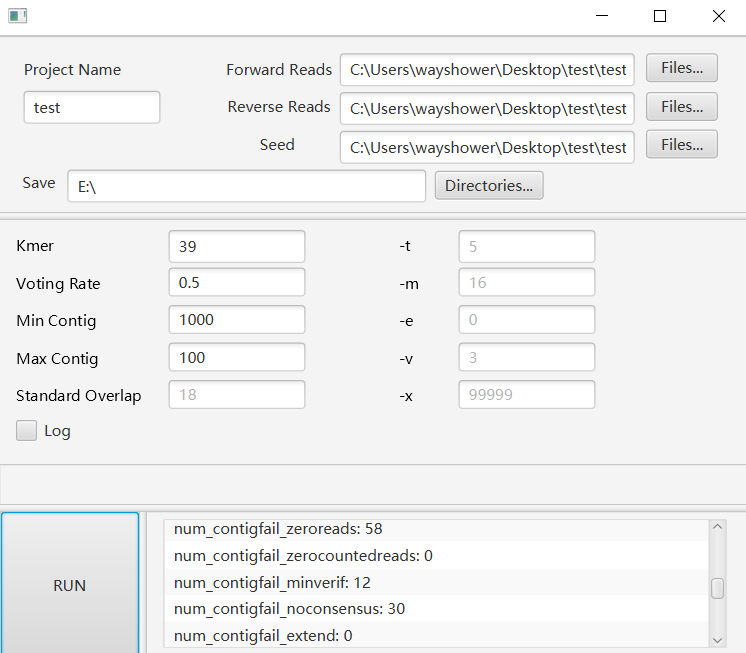
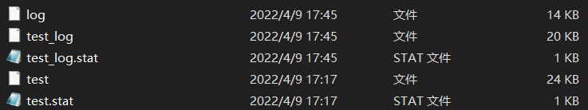
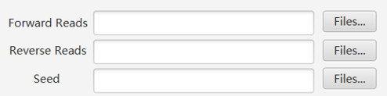
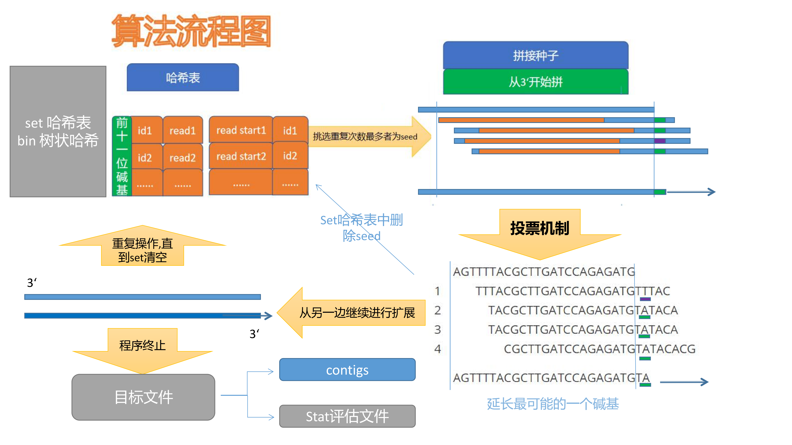

# MyAssembler——基于VCAKE算法的二代测序基因组小序列拼接软件

本项目为四川大学2021-2022年度大学生创新训练项目。

成员与分工：

| 姓名 |       专业       |             分工             |
| :--: | :--------------: | :--------------------------: |
| 张** | 计算机科学与技术 |      算法实现与程序编写      |
| 向** |      生物学      |  UI界面编写与生物学背景支持  |
| 丁** |       数学       |      算法研究与改进分析      |
| 王** |     口腔医学     | 软件测试对比与生物学背景支持 |
| 杨** |      物理学      |      算法研究与改进分析      |

## 项目概要

本项目为基于vcake算法（vcake项目下载地址：https://sourceforge.net/projects/vcake/）实现的跨平台可视化二代测拼接软件。具有全平台一致和可视化操作的特点。

软件运行示例：

输出文件示例：

## 环境要求

- cmake 版本>=3.8 (低版本可能会导致无法正常输出编译文件)
- 拥有java运行环境(命令行执行不需要)。

## 安装

- 下载文件或压缩包，解压。

- `windows`用户直接双击运行根目录下的`install.bat`脚本即可完成安装。

- `linux`和 `macOS`用户在根目录中打开命令行，执行下述命令：

  `sudo sh install.sh`

## 运行

MyAssembler有两种运行方式，**命令行运行**和**图形界面运行**。

- **命令行运行：**在`bin`目录中以`可执行程序 参数选项1 参数1 参数选项2 参数2...`的格式运行，例如：
   - `windows`系统中：`MyAssembler.exe  -f test_R2.fasta -r test_R1.fasta -s seed.fasta -t 5 -c 0.6 -e 0  -k 39`
   - `linux`和`macOS`系统：`./MyAssembler  -f test_R2.fasta -r test_R1.fasta -s seed.fasta -t 5 -c 0.6 -e 0  -k 39`

- **图形化界面运行**: 在具有java运行环境的设备上运行`MyAssembler/src/java/src/main/java/com/example/realui`路径下的`Main.java`文件，即可运行该项目的命令行程序。后续版本将更新打包后的图形界面文件，届时将不需要java运行环境便可使用图形界面。

## 参数

**基本参数(括号中为命令行程序运行时参数选项)：**

`Kmer（-k）`: 输入文件中的reads长度。较长的reads将被裁剪为Kmer长度。（默认为39）

`Voting Rate(-c)`:投票比率。提供扩展所需的代表多数碱基的比率。提高这个值将趋向于创造更可靠但更短的contigs，降低值会创造更自由的结构。（默认为 0.6）

`Min Contig(-o)`:以bp为单位设置要打印为contig的最小contig长度。（默认为打印所有contig长度）

`Max OutputNum(-q)`:设置程序将打印的最大contigs数。设计主要是为了开发目的和测试装配参数。（默认为一真打印直到种子序列耗尽）

`Standard Overlap(-n)`: 为从'bin'哈希表中获取的序列集提供标准重叠，该序列集将用于在为下一个碱基投票，并以此扩展种子序列。该程序将读取最小重叠范围内的所有数据，因此要确保该值不能太小，以保证基因组中的许多地方不会有相同序列的n-mer。（默认为18）

**可选参数：**

`-t`:在跳转到自由重叠要求之前的reads数量。这能够处理基因组覆盖碰巧很轻的情况(可能是由于测序技术导致reads分布不均)。如果在所有reads达到 Standard Overlap 个碱基的重叠之后，发现了小于-t 的重叠reads，则将下降到所有具有-m 个重叠碱基的reads。如果再次找到小于-t reads，并且指定了参数-e，则开始其最宽松的重叠要求。它将再次开始寻找重叠到 -e 的reads. 设置-t 太 将有效地导致总是以较差的重叠来看待这些reads，但设置过低会使算法很容易陷入低覆盖率的区域。（默认值为5）

`-m`:给出了如果在至少 Standard Overlap 个碱基中发现小于-t reads的重叠，则给出组装 k-MERS 的最小重叠。将此参数设置低将允许在低覆盖率区域进行松散匹配，而将其设置得更高将保持更严格的匹配。 影响可能是不同的，取决于-t 和reads数据在源基因组中的分布。(默认值16)

`-e`:给出允许在重叠序列集合中添加带有单个错误的reads的最小重叠。只有在没有发现重叠 -m 基或更多的 -t reads的情况下才使用。（默认为不允许错误）

`-v`:设置终止前允许的除多数基之外的单个碱基的最大调用数。这防止了重复元素的扩展，但如果排序技术中存在较高的非随机错误率，则会适得其反。（默认值为3）

`-x`:设置可接受的最大重复reads数，以避免组装重复的元素。我们建议将此值设置为大约 10 倍或更多的预期reads次数，考虑到所涉及的序列的长度、测序的覆盖深度和所需的重叠值。如果reads数据是随机分布在基因组上的，那么这个参数可以很好地工作。（ 默认为允许无限重叠）

## 输入与输出

**输入文件：**

本程序使用基于种子序列的扩展算法，因此需要三个输入文件：

- 正向测序文件（forward sequence）

- 反向测序文件（reverse sequence）

- 种子序列文件（seeds sequence），可能为下述不同类型的种子（无恰当的种子序列时可由正/反向测序文件代替）:

  - 测序生物（或细胞器）基因组的数据集上的单个read。

  - 从相同或相近的物种中衍生出来的序列。

  - 更遥远物种的完整序列(推荐在没有近缘序列时使用)

所有文件的格式应该像一个标准的fasta文件(第一行:&gt;Id_sequence)（支持格式：`.fq  .fasta  .fastq`）

通过UI上端的三个文件选择器输入文件：

同时需要设置项目名称及保存路径。

**输出文件：**

标准输出两个文件:

- `ProjectName.contigs`拼接完成的contig序列文件。
- `ProjectName.stat` 拼接质量统计文件（包括运行时间、平均contig长度等）。

若勾选`log`选项，则还输出程序的日志文档（一般情况下该文件较大，不建议勾选）：

- `ProjectName_log`

以上所有文件均输出到设置的保存路径中。

## 算法

本项目采用基于经典拼接算法Overlap-Layout-Consensus (OLC)的改进算法VCAKE作为核心算法[^1]，相比原算法具有辅助纠错与高准确率的特点。基于性能和跨平台考虑，选择以c语言为主要开发语言，以cmake作为编译构建工具，使用JAVA完成UI界面编写。编写时充分考虑跨平台因素，使用标准的c语言开发库，不会造成系统差异，同时对原软件做出改进：能够读取反向reads文件，大大提高拼接准确度， 非核心算法部分相较原软件更加简洁，磁盘占用更小。

**算法流程图：**

**算法核心：**

1. bin 和 set 哈希表。

   该算法从读取两个多 Fasta 文件开始.一个文件加载到“set”引用的哈希表中，另一个文件加载到“bin”引用的哈希表中。

   “set”哈希非常简单。它包含的键是在其各自的多 Fasta 文件中找到的完整序列及其反向补充，而它的值是键控序列或其反向补码在文件中出现的次数。

   “bin”哈希有点复杂。它是一个散列树，共有 12 个有序键，指向最终值。“bin”散列中的最后一个键及其值类似于“set”散列--即第 12 键是要加载到‘bin’的多 Fasta 文件中的完整序列或反向补充序列，其值是完整序列或其反向补码出现的次数。按照顺序，前面的 11个键是从最终键中序列的前 11 个碱基。这种更复杂的“bin”结构允许从给定的 11 个碱基集合开始对序列进行有效搜索，大大缩短了搜索数百万次reads所需的计算时间。在前 11 个键的哈希树后面，给出了在多 Fasta 文件(或它们的反向补码)中找到的以这些碱基及其在文件中的频率开始的所有序列的集合。该方法直接从 SSAKE 算法中提取。

2. 循环

   然后，该算法将“set”中的键按其各自的值(出现次数)和“种子”连体结构与最频繁表示的序列进行排序。这个过程的目的是增加早期连接从无错误reads序列开始的可能性。任何一个给定的错误，如果排序有任何质量，应该比正确的序列少，从而导致正确读的频率明显增加。每个“种子”序列首先从“set”中删除。然后迭代地按 3‘方向扩展，每次一个碱基，使用在“bin”中读取的数据。当这种情况不能继续时，则产生的连体是反向补充的，并且使用相同的方法来扩展 3‘(以前的 5’)方向。一旦完成这个方向，contig 就会被打印到一个输出文件中，下一个最频繁的序列将从“set”中选择为下一个“种子”。这种情况一直持续到“set”耗尽为止。重要的是，在扩展过程中从‘bin’和‘set’中删除reads，这样就不会将‘set’中的每个序列用作种子。

3. 扩展

   “种子”序列延伸到连续体的过程是该算法的核心之一。SSAKE 从不断增长的连体的 3‘端选择了 k-MERS，发现在“bin”中读到的与 k-mer 的重叠最大(直到最小的重叠，n)。然后，它使用整个reads的突出部分来扩展序列。而VCAKE算法通过一次扩展一个基来处理，并通过搜索所有 k-MERS 到那个大小的‘bin’来考虑与种子序列充分重叠的所有reads。

   VCAKE 还改变了发现重复序列的方式，以避免错误组装。SSAKE 需要两个与种子序列完全重叠的不一致序列的reads。考虑到足够长度的所有重叠，VCAKE 将寻找两种情况之一。首先，它检查重叠序列的数量不超过某个用户定义的阈值‘x’。这个“验证”步骤是基于这样的假设：在基因组中代表不止一次(或多次)的序列同样会在序列reads集中被高估。在大多数焦测序的情况下，这个假设并不完全准确，但仍然是有用的(未公布的结果)。如果重叠reads的次数大于“x”，则扩展将立即在该方向终止。重复序列也是通过寻找在调用下一个碱基时经常出现的不一致来检测的。

   VCAKE 计算重叠‘bin’序列中每个碱基的频率，以确定要添加到其种子中的下一个碱基。通常，它会检查最频繁的基值是否比设定的比率阈值‘c’更频繁。如果最常见的基值发生在频率小于“c”的地方，则扩展停止。同样地，如果一个不一致的基比一个固定的绝对频率‘v’更频繁地出现，那么这个连续词就被终止。这两种情况都表明，在下一个基础上存在着不确定的情况，从而增加了结合体的数量，并且有合理的可能性，即种子序列的多个扩展序列实际上存在于源基因组的某个地方。在扩展了一个碱基之后，VCAKE 检查它从‘bin’中提取的任何重叠序列现在是否完全发生在连续体中。如果是这样，则认为已使用reads，而 VCAKE 试图将其从“set”和“bin”中删除。这样可以防止冗余程序集。还包括一个重要的额外渔获量。如果一个给定的读被用来添加多个碱基，其长度是reads本身的两倍，则删除该reads，并在该方向终止该连续扩展。这一奇怪的捕获是必要的，以防止罕见的情况下，非常接近重复的序列可以无限扩展，使程序集停止。

## 帮助

由于我们尚处大二开发能力有限且主要开发者只有两人，主要出于学习的目的开发了这款软件，程序目前仍不是十分完善。如果程序存在任何运行问题或其他bug，还望您谅解并通过邮箱联系我们：934338849@qq.com. 我们将及时回复并尽可能快速地修复bug。

如您有其他任何意见或建议，也欢迎联系我们，感谢您为该程序的改进做出的贡献！

[^1]:Jeck WR, Reinhardt JA, Baltrus DA, Hickenbotham MT, Magrini V, Mardis ER, Dangl JL, Jones CD. Extending assembly of short DNA sequences to handle error. Bioinformatics. 2007 Nov 1;23(21):2942-4. doi: 10.1093/bioinformatics/btm451. Epub 2007 Sep 24. PMID: 17893086.
